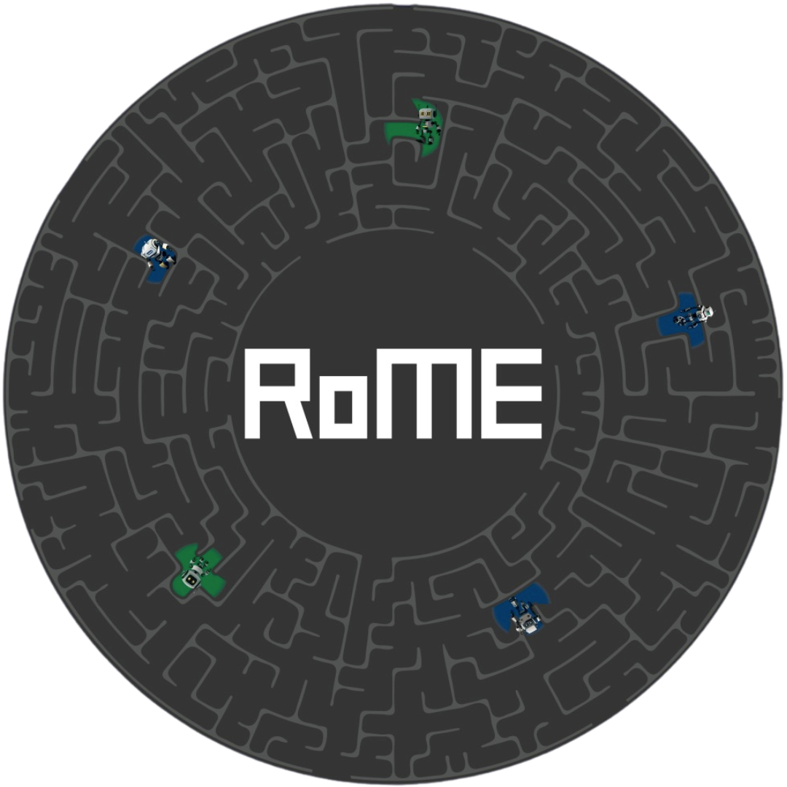

# RoME 2024

Welcome to the 2024 RoME Summer School!

## RoME Robot Missions

This repository contains some exercises and tutorials for ROS2, Nav2 and Behaviour Trees in general for use in the RoME 2024 working sessions.
If you're not familiar with ROS we recommend you check out all the tutorials before the working sessions in the 21st of April.

If you have any questions feel free to ask us in the telegram chat group.