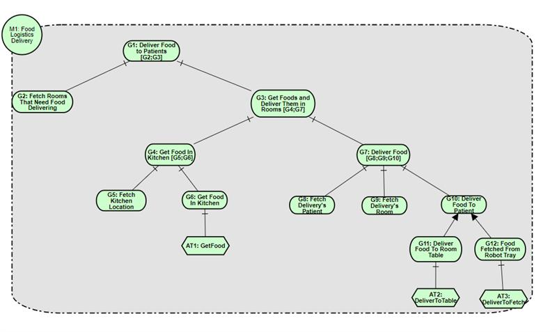

# Turtlebot4 Working Session Directions

## Objectives

 This working session has the following objectives: (i) modelling of robotic missions using goal models; (ii) design and implementation of robotic missions in behaviour trees using the BT.CPP framework; (iii) uncertainty scenarios and recovery patterns; (iv) testing and applying those concepts in real turtlebot4s.

## Exercise 1: Implement food logistics mission as a BT based on mutrose goal modelling

The food logistics scenario from the RoboMAX Mission Exemplars is described as follows:

“The robot must receive a request from the kitchen to deliver a dish to a specific room. Upon receiving a delivery request the robot must move to the kitchen and confirm it received the dish. Then the robot must deliver the dish to a patient in the specified room and confirm the delivery after its made.”

And was then modelled as a Goal Model in Mutrose:

Your objective in this first exercise is to design a behaviour tree in Groot and implement any other nodes you may find necessary in C++. Then execute the simulated mission in Gazebo Ignition. For ease of simulation we will use the default warehouse map shown on the tutorials. During the working sessions we will give you the coordinates that represent the starting position of the robot, the kitchen and the room the robot must deliver food to.

## Exercise 2: Implement 3 recovery scenarios

Your first implementation is not free of uncertainties. Now you will need to implement recovery behaviours to handle those uncertainties. Pick 3 of the 5 uncertainty scenarios below:

1.Check for battery level.

	Make sure the battery is above 15% while executing the mission, else make the robot move to a charging dock.

2.Estimate time to complete mission and recalculate path.

	Given a path to an objective, create an estimate for the time to complete a mission then choose the path with the fastest time. Hint: Think of the navigation aspect of the mission as a collection of waypoints.

3.Use LIDAR to check for obstacles.

	Nav2 already performs some checks on obstacles during navigation. But what if we want to have our own checks, such as predicting if an object will obstruct our path before nav2 notices it. Use LIDAR to check if an object is in a certain distance to your robot during navigation.

4. Use the TB4 camera and OpenCV or DepthAI to detect and identify obstacles.
   
	Computer vision and AI are an important part of robotics. Try to use an AI algorithm from one of these frameworks to identify an obstacle near the robot.

5. Human in the loop.

	Robots often need to interact with humans in a meaningful way. Try to implement a behaviour that needs human interaction before proceeding with the mission. A possible example is detecting and authenticating a human with a camera or voice recognition.

## Exercise 3: Implement your behaviour tree in a real Turtlebot4.

Use SLAM to plot out a map from your lab to the CiC kitchen area (in portuguese: Copa) (make sure you mark the robot’s initial position as it will be considered the start point of the map). Read the turtlebot4 documentation and try to improve your previous tree to perform the mission with a real robot. Afterwards test your robot against the uncertainty scenarios you selected in the previous exercise (2).

