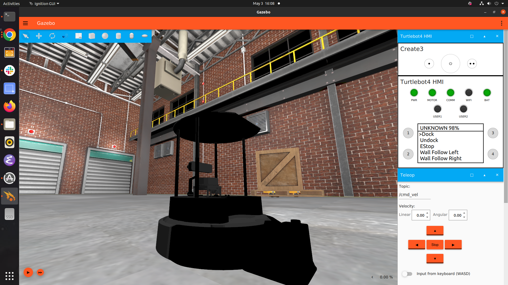
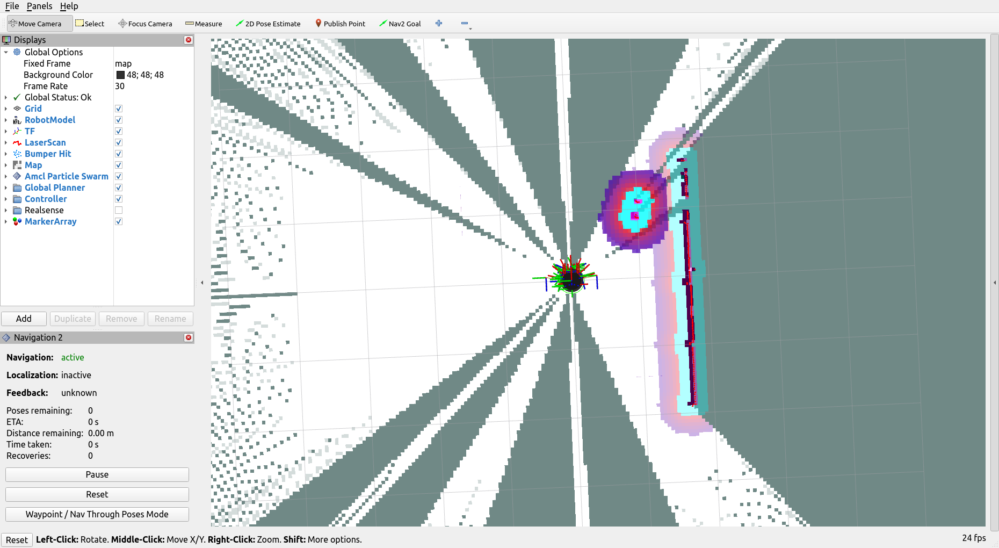

# Nav2 Tutorial

[Nav2](https://arxiv.org/abs/2003.00368) is the most used autonomous navigation framework for ROS2. In this tutorial we
will show you how to use the framework to control the robot so it can navigate its environment.

### Docs

Please check the official [documentation](https://navigation.ros.org/) for additional references.
Feel free to also ask us any questions on the Telegram group chat.

### Installation

This tutorial assumes you already installed ROS2 Humble (as per the previous tutorial) and are running Ubuntu.

1. Install the ros-dev-tools package.

```bash
sudo apt install -y ros-dev-tools
```

2. Install the nav2 packages with apt:

```bash
sudo apt install -y ros-humble-navigation2
sudo apt install -y ros-humble-nav2-bringup
```

3. Install Gazebo Ignition (Fortress)

```bash
sudo apt-get update && sudo apt install -y wget
sudo sh -c 'echo "deb http://packages.osrfoundation.org/gazebo/ubuntu-stable `lsb_release -cs` main" > /etc/apt/sources.list.d/gazebo-stable.list'
wget http://packages.osrfoundation.org/gazebo.key -O - | sudo apt-key add -
sudo apt update && sudo apt install -y ignition-fortress
```

4. Install the turtlebot4 packages

```bash
sudo apt update
sudo apt install -y ros-humble-turtlebot4-desktop \
ros-humble-turtlebot4-description \
ros-humble-turtlebot4-msgs \
ros-humble-turtlebot4-navigation \
ros-humble-turtlebot4-node \
ros-humble-turtlebot4-simulator
```

## An Overview of Autonomous Navigation

We can think of robotics navigation by using an analogy to how humans navigate. Suppose a person wants to go to their
local grocery store. The first step would be to use their knowledge on their area and plot an optimal path from their
home to the grocery store. This implies that the person is at least roughly aware of their street layout and knows which
way to move in order to reach their destination efficiently. That is the equivalent of our robot’s global planner, it
analyses the known map data and plots a route through to its destination.

However once we plot our destinations we are not aware of every obstacle in the path we have chosen. Once we are
navigating through the streets we may encounter a multitude of obstacles, such as cars, trees, lamp posts that we must
avoid using our sensory information. And that’s what the local planner treats in our navigation stack, it uses the laser
sensor information to establish a costmap on nearby objects. It then assigns a weight based on the footprint or the
rough size of our robot, and makes tiny changes to the global path in order to avoid collisions with nearby objects.

Another important aspect of navigating a robot is localisation. Through ROS we represent the rigid body dynamics of our
robot as a tree of transformation coordinates. Each joint and moving part of our robot is represented by a coordinate
system, alongside its proper moment and inertia as defined in the robot descriptor file. And then movement of our robot
is represented by transformations applied through the tree.

In order to achieve robot localisation we start with a fixed coordinate, which is our map frame,
then the odometry, that is the relative displacement of our robot in relation to the fixed map frame, is computed as the
robot moves and is propagated to the transform tree. The
navigation stack uses a monte carlo simulation called amcl to simulate the current position
of our robot and align it with the transform tree. That way we can know roughly where our
robot is and its sensors can know where they are located in relation to the robot so we can
have accurate sensor data.

### The Nav2 Framework


*Taken from [nav2 docs](https://navigation.ros.org/index.html)*

Navigation is controlled through behaviour trees which we will discuss in detail in the next tutorial. The navigation
stack
itself is subdivided into 3 different servers: Control, Planning and Recovery. User defined BTs that implement
navigation behaviour occupy the highest level and have control over all layers of the stack.

The Control and Planning Layer work in tandem to compute navigation paths. The global planner computes the shortest path
from the initial robot position to its goal while the control planner manages local short path estimations and controls
the robot motion based on sensor data, usually LIDAR.

Finally there's the Recovery server which interacts with either global or local navigation in order to avoid a complete
failure. Recovery behaviours implement a certain action to be taken usually after a Failure Tick is returned by a
navigation node or as part of a Fallback node. An example of a local recovery behaviour would be the robot spinning in
place to try to free itself, while a global recovery behaviour can be recalculating the global route or the costmap
function.

## Navigating with a Turtlebot4

By default the Turtlebot4 uses the Gazebo Ignition Simulator. You can launch the simulator with default settings using
the following command:

```bash
ros2 launch turtlebot4_ignition_bringup turtlebot4_ignition.launch.py
```

After a while you should see the robot in a warehouse environment as shown below:



You can start the simulation by clicking the Play Button in the bottom left corner. Then you can control the robot with
the arrow keys shown on the right
or with the cmd_vel topic.

```bash
ros2 topic pub /cmd_vel geometry_msgs/Twist "linear:
  x: 0.0
  y: 0.0
  z: 0.0
angular:
  x: 0.0
  y: 0.0
  z: 0.0"
```

Now that we have a robot in simulation we can start using nav2 to navigate the environment. Launch the robot with nav2
enabled with the following command:

```bash
ros2 launch turtlebot4_ignition_bringup turtlebot4_ignition.launch.py slam:=true nav2:=true rviz:=true
```

We highly recommend a dedicated GPU to run the raytracing for the LIDAR in simulation, often the LIDAR rays behave
weirdly without a dedicated Nvidia or AMD card.

Using the syntax arg:=value we can pass arguments to launch files in ros. With the command above we are initialising
nav2 with synchronous SLAM (Simultaneous Localisation and Mapping) and the robot visualising tool rviz.

To start the simulation you should run the start button in Gazebo and then click the 2d pose estimate button in rviz so
the localisation server has an estimate for the robot's initial pose, try to line up the LIDAR rays with the environment
so you have a better estimate (see figure below).You should see the following rviz screen alongside the previous Gazebo
warehouse map:



In the next section we will show you how to use rviz and how to perform SLAM and save the 2d map scan so we can have map
knowledge in future missions.
For now, you can click the Nav2 arrow to send goals and watch the robot generate its path and then move to its
destination.

## SLAM

We can consider two different types of navigation for robotic missions, in some missions we have a complete map of the
environment
and thus we can accurately model our robot in the environment. However, quite often we deploy robots in situations where
we aren't aware of the region the robot is located and that's where we use SLAM algorithms to map the environment before
executing a mission.

In ROS we generate a localisation for navigation planning through a 2d map scan generated by first moving the robot
through its environment while the LIDAR sensor scans a region around the robot.

You can use different teleop controls to manually move the robot while performing SLAM with either a mouse or a video
game controller or simply use the nav2 goals as mentioned.

In rviz we can see a red trail which represents the 2d LIDAR scan and a cloud of blue to red points which represents the
local navigation costmap, i.e. how costly it is for the robot to manuever in the region,
areas coloured grey have an unknown cost while areas coloured white have a free cost to move. Now areas with blue to red
are closer to obstacles and may cause the robot to get stuck so their cost to manuever is much higher.
Finally, areas in cyan are points where the robot's footprint overlaps with the obstacle and thus the robot cannot
maneuver at all.

Once you are satisfied with your map scan you can save your map by opening a new terminal and running the following
command:

```bash
    ros2 run nav2_map_server map_saver_cli -f ~/map
```

Here's a gif example taken from the [nav2 docs](https://navigation.ros.org/tutorials/docs/navigation2_with_slam.html):


## Configuring Nav2

There are many different possible parameters we can configure for our navigation, in this section we will explore a
couple of the more important parameters in more detail.

But first we can see all the possible arguments we can pass to the simulation launch script by running:

```bash
ros2 launch turtlebot4_ignition_bringup turtlebot4_ignition.launch.py --show-args
```

The map parameter represents the path to the 2d map scan we saved on the previous section.

```   
'map':
   Full path to map yaml file to load
   (default: LocalVar(''/opt/ros/humble/share/turtlebot4_navigation' + 'maps' + 'warehouse.yaml''))
```

You can run localisation with your saved map with the command below:

```bash
ros2 launch turtlebot4_ignition_bringup turtlebot4_ignition.launch.py nav2:=true rviz:=true localization:=true map:='full_path_to_your_map_yaml'
```

And the params_file parameter represents the map to the yaml configurations for nav2.

```
'params_file':
    Full path to the ROS2 parameters file to use for all launched nodes
    (default: '/opt/ros/humble/share/nav2_bringup/params/nav2_params.yaml')
```

Feel free to copy the file from the default path and try to edit different parameters and see what changes in the
simulation, with this file we can edit for instance the robot's maximum speed, rotation and acceleration as well as
different algorithms for calculating the costmap and SLAM.

Importantly, we can set a default behaviour tree with the default_bt_xml_filename parameter within the bt_navigator
configuration, as well as creating new custom BT nodes (called plugins in nav2) with the plugin_lib_names parameter:

```
bt_navigator:
  ros__parameters:
    use_sim_time: True
    global_frame: map
    robot_base_frame: base_link
    odom_topic: /odom
    default_bt_xml_filename: "navigate_w_replanning_and_recovery.xml"
    plugin_lib_names:
    - nav2_back_up_action_bt_node 
    - nav2_wait_action_bt_node    
```

*Example bt_navigator configuration*

In the next Behavior Tree tutorial we will show you how to create custom programmable nodes with c++ and how to create
trees with nav2.
