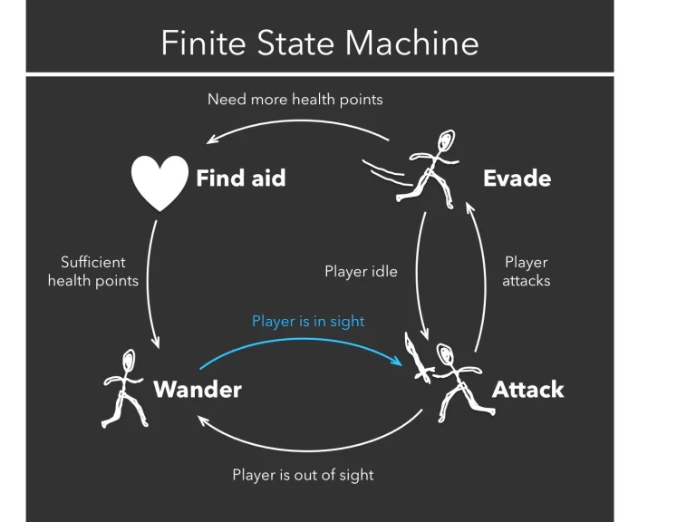
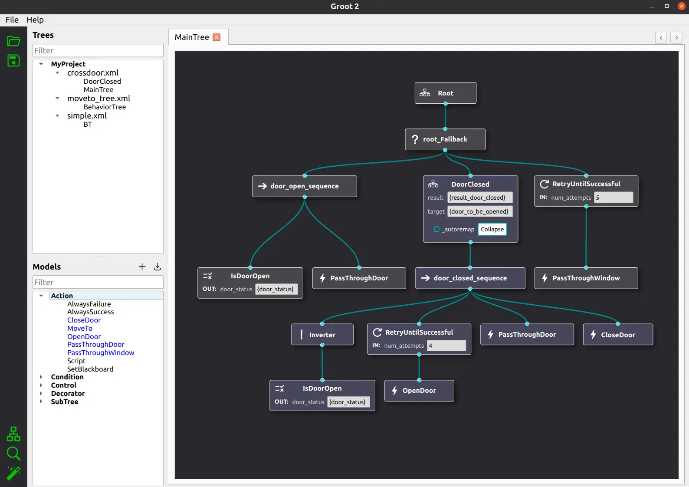
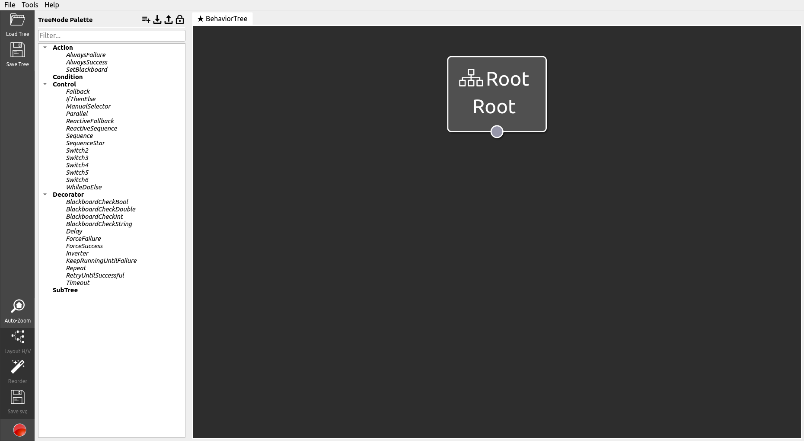
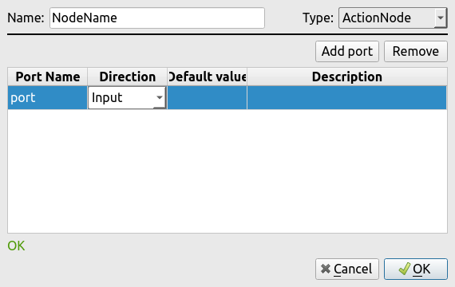
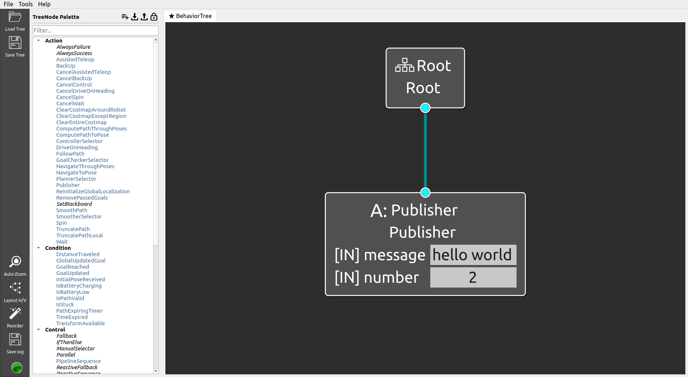
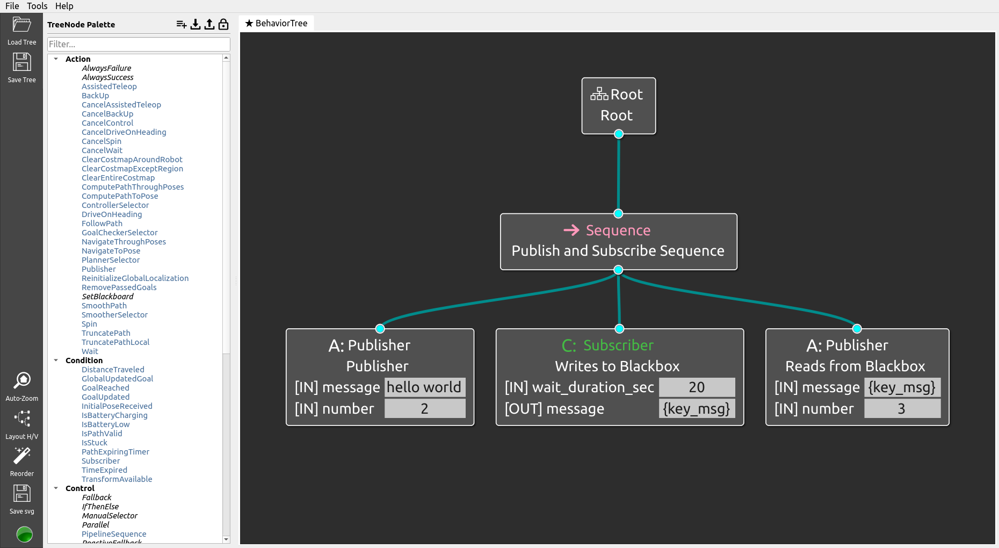
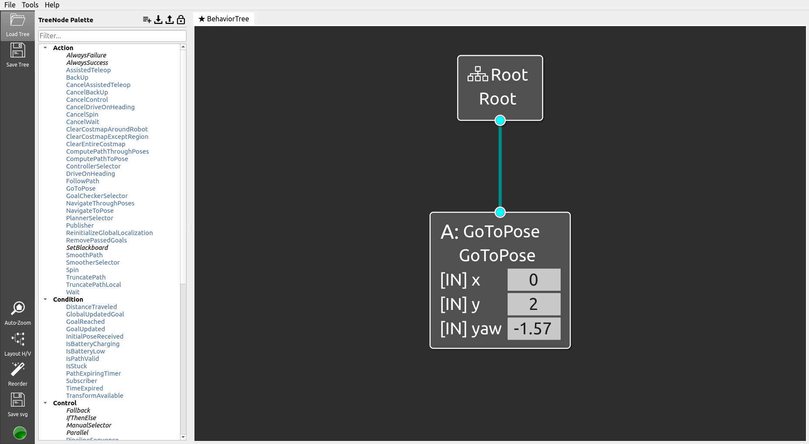

# Behaviour Trees Tutorial

## Docs

Please check the [BT.CPP v3 Docs](https://www.behaviortree.dev/docs/3.8/intro) as well as the [Nav2 BT Docs](https://navigation.ros.org/behavior_trees/index.html)
for additional references.

The theory behind the Behaviour Trees presented here is based on the book [Behavior Trees in Robotics and AI](https://arxiv.org/abs/1709.00084). 
We highly recommend reading the book if you want to know more about behaviour trees in robotics, for this tutorial 
specifically we will mostly use the first 2 chapters. 

## Installation

1. Install the ROS2 Humble nav2 packages (see Tutorial 2)
2. Install Groot (BT editing tool)

```bash
sudo apt install -y git qtbase5-dev libqt5svg5-dev libzmq3-dev libdw-dev cmake build-essential
git clone https://github.com/BehaviorTree/Groot.git
cd Groot && git submodule update --init --recursive && mkdir build && cd build && cmake .. && make
```

3. Build the rome_bt and rome_sim ROS2 packages.

```bash
source /opt/ros/humble/setup.bash
colcon build
```

4. Source the package installs.

```bash
source install/setup.bash
```

## An Overview of Behaviour Trees

Behavior Trees in Robotics and AI defines Behaviour Trees as "a way to structure the switching between different tasks
in an autonomous agent, such as a robot or a virtual entity in a computer game". BTs occupy a similar place to FSMs (
Finite State Machines) as a control structure. However as we will discuss, they offer much more in terms of robustness
and modularity to an application.

Behaviour Trees or HFSMs (Hierarchical State Machines) were initially created for controlling game AI and NPCs as a way
of better modelling complex behaviour and creating more interesting scenarios and interactions for the player. More
generally, BTs can be used to express both modelling and implementation characteristics for any autonomous agent system,
while traditional FSMs struggle with implementation particularly in terms of properly expressing state transitions.

Traditionally FSMs are built as a connected graph of nodes representing states and links representing state transitions.
Each link is associated with a certain trigger condition which changes the current state of the system. We can already
spot one of the major issues with implementing FSMs which is in order to change a single state we would have to change
all of its links and quite often that would also imply changing the entire control structure.


*Finite state machine for a simple shooting video game.*

In the figure above, we can also infer that FSMs are inherently not scalable. Even simply adding different
attack or wander patterns would result in multiple different state transitions with potentially many of them being
redundant or repetitive. Now imagine the same issue, but in more complex systems with thousands of states and
transitions and the whole structure becomes unreasonably expensive to maintain.

BTs fundamentally differ from FSMs in that they have an inherent hierarchical structure which implies a certain order of
operation. They are represented as a tree connected graph where nodes can be either roots, i.e. they have no parent
nodes above them, or leafs or non-leafs, a leaf node has no child nodes beneath them. Henceforth we will also be using
the BT notation used in which is also used for the BehaviorTree.CPP framework to
be discussed later in this section.

Leaf nodes usually imply a certain behaviour which is an action taken by the agent, such as picking up an object or
interacting with the environment. When executing said action they will return a Tick to its parent indicating its
current state. Ticks are what causes state transitions inside a BT and they can either be Running, as in the child node
is currently executing its action, or Success or Failure implying the result of the action being completed.

Leaf nodes are an example of an execution node which are typically classified as either Action or Condition nodes, where
Condition nodes return Success if a certain predicate holds and Action nodes are self-explanatory.

There is also the case of Reactive versus Non-Reactive BTs, where the non-reactive kind does not have a Running tick and
only cares about the result of an action. Non-reactivity has several drawbacks and are
not useful in the context of this project in implementing BTs as skills for robotics, as reacting to feedback received
from actions is essential in control systems.

Non-leaf nodes are subdivided into 4 different types and mostly imply making a certain decision about its child nodes.
Specifically those are:

- Sequence Nodes will execute its children nodes from left to right until all of them return a Success Tick. If any
  child returns a Failure or Running tick the node will propagate the same tick upwards. Therefore it returns Success
  iff all its children return Success.
- Parallel Nodes routes Ticks to all its children and returns Success if a certain number M of its N children returns
  Success, $M\leq N$. It returns Failure if N-M+1 children return Failure and otherwise it returns Running.
- Fallback Nodes will execute its children nodes from left to right until any child returns Success or Running then it
  will return Success or Running. Therefore it only returns Failure iff all its children return Failure.
- Decorator Nodes have a single child and alter the Tick of its child according to a user specified rule. For instance
  one could have an inverting decorator that only returns Success if its child returned Failure.

Finally, as with many AI systems, BTs have a type of memory in the form of a Blackboard which is a series of variables,
essentially a dynamic database which is accessible by any node inside of the tree.

In the context of robotics BTs have also been widely used precisely because what makes BTs useful for autonomous agents
are also extremely useful when incorporated into robotics systems. That is, robotic systems have classically been built
on top of modular feedback control structures which naturally lend themselves quite well to a BT behaviour. It's also
important to note that a hierarchy of tasks is fairly common in robotics as complex tasks can often be decomposed into a
sequence of simpler tasks which also aligns quite well with the philosophy behind BT development.

## BT.CPP



*Picture of a behavior tree for a robot to open a door.*

BT.CPP is one of the most used frameworks for the development of behaviour trees and was also created by the same authors
as the Behavior Trees in Robotics and AI book.

## Nodes and Trees

Nodes are a way to express behaviours upon receiving an activation condition (a tick). In our lab we often use behaviour
for both dynamic and static behaviours in mission engineering, that is BTs can be composed prior to the mission as well as
created and assigned at runtime.

Read the first tutorial on BT.CPP: https://www.behaviortree.dev/docs/3.8/tutorial-basics/tutorial_01_first_tree/ that explains
the basic functionality of behaviour trees and how to create them within the framework.

## Blackboard and Ports

Blackboards are a way to express the world knowledge of a mission and to pass data between nodes. It's essentially a global
hash map that nodes can read and write from. Entries are accessed by the {} keyword, meaning {goal} corresponds to the goal
variable in the blackboard.

Often variables are named {key_value} and can be accessed by the key variable. Nodes can access variables from the blackboard
through the use of either input or output ports.

Read the second tutorial on BT.CPP: https://www.behaviortree.dev/docs/3.8/tutorial-basics/tutorial_02_basic_ports that goes 
further into basic ports and using the blackboard in the framework.

## Groot - Creating a BT

Groot is a behaviour tree visualising tool that lets us create and edit BTs as well as monitor them in real time.
After installing run it with:

```bash
Groot/build/Groot
```



Drag and drop nodes to place them in the tree. On the side you can also Load and Save Trees.

In order to create a custom node you can click the 3 bars icon next to the TreeNode Palette.



Created nodes are added to the palette. You can then either save the tree or save the palette as an xml to save these nodes.
However, nodes still need to be implemented in c++ separately as Groot only handles the modelling aspect of BTs.

Once you have created your tree execute it with the following command:

```bash
ros2 launch rome_bt execute_bt.launch.py bt:="full/path/to/tree"
```

## Creating a custom node plugin

We have provided the rome_bt package to make it easier for you to develop and run your trees. Usually to develop nodes 
we create a header file with all our definitions in /include and the actual code implementation in the /src directory.

To execute a node we need to register it to the BT.CPP dynamic loader to load it during runtime. Now we present a couple examples on 
custom nodds we created

### Publisher Node


A publisher node publishes a message to a ROS topic. We create a class that inherits from the SyncActionNode class which has no running status,
in our implementation this means that upon receiving a tick the node will immediately publish a message. Alternatively
you can also have async actions in your tree.

Header:
```c++
class PublisherNode: public BT::SyncActionNode{
    public:
        explicit PublisherNode(const std::string &name,
                               const BT::NodeConfiguration &config,
                               rclcpp::Node::SharedPtr node_ptr);

        BT::NodeStatus tick() override;

        static BT::PortsList providedPorts() {
            return BT::PortsList {BT::InputPort<std::string>("message"),
                                  BT::InputPort<int>("number")};
        }


    private:
        rclcpp::Publisher<std_msgs::msg::String>::SharedPtr str_publisher_ptr_;
};
```

Every action needs to have the static function providedPorts which returns a list of the ports created in Groot.
Alongside that actions need to implement a tick function and async actions need to implement a halt function.

Implementation:
```c++
PublisherNode::PublisherNode(const std::string &xml_tag_name,
                             const BT::NodeConfiguration &conf,
                             rclcpp::Node::SharedPtr node_ptr): BT::SyncActionNode(xml_tag_name, conf){
    std::string topic = "hello";
    auto qos = rclcpp::SystemDefaultsQoS();
    qos.best_effort();
    str_publisher_ptr_ = node_ptr->create_publisher<std_msgs::msg::String>(topic, qos);
}

BT::NodeStatus PublisherNode::tick(){
    std_msgs::msg::String str_msg;
    auto msg = getInput<std::string>("message");
    auto num_input = getInput<int>("number");
    int times_to_send = num_input.value();
    str_msg.data = msg.value();
    for(int i=0; i<times_to_send; i++){
        str_publisher_ptr_->publish(str_msg);
        sleep(1);
    }
    return BT::NodeStatus::SUCCESS;
}
```

We create a constructor which initialises the publisher on the /hello topic. Then we create a function to be executed every tick.
The function takes the message argument from the input port and publishes it the number of times specified in the number input port.

Finally we return a NodeStatus::SUCCESS.

To register a node into the BT executor we add an include in the bt_executor.cpp file and then add the following code to the 
create_behavior_tree function:

```c++
BT::NodeBuilder builder = [=](const std::string &name, const BT::NodeConfiguration &config){
    return std::make_unique<PublisherNode>(name, config, shared_from_this());
};
factory_.registerBuilder<PublisherNode>("Publisher", builder);
```

### Subscriber Node


Now we create a condition node that returns SUCCESS if it receives a message within the specified wait duration, else it returns FAILURE. You can also see from the tree that we are using the blackboard to transfer data between the subscriber and publisher nodes. That way the subscriber node first receives a message and passes it to the publisher node.

Header:
```c++
class SubscriberNode: public BT::ConditionNode{
    public:
        explicit SubscriberNode(const std::string &name,
                                const BT::NodeConfiguration &config,
                                rclcpp::Node::SharedPtr node_ptr);

        BT::NodeStatus tick() override;

        static BT::PortsList providedPorts() {
            return BT::PortsList {BT::OutputPort<std::string>("message"),
                                  BT::InputPort<int>("wait_duration_sec")};
        }

        void update_msg(const std_msgs::msg::String::SharedPtr new_msg);
        bool wait_for_message(int wait_duration);


    private:
        rclcpp::Subscription<std_msgs::msg::String>::SharedPtr str_subscriber_ptr_;
        std::string msg_;
};
```

Implementation:
```c++
BT::NodeStatus SubscriberNode::tick(){
    auto wait_duration_sec = getInput<int>("wait_duration_sec");
    int wait_duration = wait_duration_sec.value();
    bool received_msg = wait_for_message(wait_duration);

    if (msg_.empty() || !received_msg)
        return BT::NodeStatus::FAILURE;

    setOutput("message", msg_);
    return BT::NodeStatus::SUCCESS;
}
```

Try to execute this tree and then publish a message on the /hello topic in another terminal.

### Go To Pose Node


Now for a slightly more complicated example we implement a nav2 ros action (navigateToPose) as a Bt action node. Since ros actions
are stateful, i.e. they provide feedback on the action we implement a class based on StatefulActionNode.

Header:
```c++
class GoToPose : public BT::StatefulActionNode {
    public:
        GoToPose(const std::string &name,
                const BT::NodeConfiguration &config,
                rclcpp::Node::SharedPtr node_ptr);

        using NavigateToPose = nav2_msgs::action::NavigateToPose;
        using GoalHandleNav = rclcpp_action::ClientGoalHandle<NavigateToPose>;


        // Method overrides
        BT::NodeStatus onStart() override;
        BT::NodeStatus onRunning() override;
        void onHalted() override{};

        static BT::PortsList providedPorts() {
            return BT:: PortsList {BT::InputPort<double>("x"),
                                   BT::InputPort<double>("y"),
                                   BT::InputPort<double>("yaw")};
        }

        // Action Client callback
        void nav_to_pose_callback(const GoalHandleNav::WrappedResult &result);

    private:
        rclcpp::Node::SharedPtr node_ptr_;
        rclcpp_action::Client<NavigateToPose>::SharedPtr action_client_ptr_;
        bool done_flag_;
};
```

Stateful actions need 3 methods to be implemented, a onStart method executed when it receives a tick, a onRunning method 
if it receives a tick while running and a onHalt action on a halt tick,

Implementation:
```c++

BT::NodeStatus GoToPose::onStart()
{
    // Make pose
    auto goal_msg = NavigateToPose::Goal();
    auto x_in = getInput<double>("x");
    auto y_in = getInput<double>("y");
    auto yaw_in = getInput<double>("yaw");
    double x = x_in.value(), y = y_in.value(), yaw = yaw_in.value();
    goal_msg.pose.header.frame_id = "map";
    goal_msg.pose.pose.position.x = x;
    goal_msg.pose.pose.position.y = y;

    // Calculate quaternion from yaw
    tf2::Quaternion q;
    q.setRPY(0, 0, yaw);
    q.normalize();
    goal_msg.pose.pose.orientation = tf2::toMsg(q);

    // Setup action client
    auto send_goal_options = rclcpp_action::Client<NavigateToPose>::SendGoalOptions();
    send_goal_options.result_callback = std::bind(&GoToPose::nav_to_pose_callback, this, std::placeholders::_1);

    // Send pose
    done_flag_ = false;
    action_client_ptr_->async_send_goal(goal_msg, send_goal_options);
    RCLCPP_INFO(node_ptr_->get_logger(), "Sent Goal to Nav2\n");
    return BT::NodeStatus::RUNNING;
}

BT::NodeStatus GoToPose::onRunning()
{
    if (done_flag_){
        RCLCPP_INFO(node_ptr_->get_logger(), "Goal reached\n");
        return BT::NodeStatus::SUCCESS;
    }
    return BT::NodeStatus::RUNNING;
}

void GoToPose::nav_to_pose_callback(const GoalHandleNav::WrappedResult &result)
{
    // If there is a result, we consider navigation completed.
    if (result.code == rclcpp_action::ResultCode::SUCCEEDED)
        done_flag_ = true;
}
```

Upon receiving a tick we read the pose data from the input ports and create an action client to the NavigateToPose action,
then we simply send an async action to the nav2 server and return a running status.

When the server responds with a success we update the done_flag which will then return a success.

Try to execute the rome_sim package and then run this node in another terminal.

```bash
ros2 launch rome_sim tb4_sim_bringup.launch.py
```

```bash
ros2 launch rome_bt execute_bt.launch.py bt:="$(ros2 pkg prefix rome_bt)/share/rome_bt/behavior_trees/bt_example3.xml"
```

## Exercises

### 1. Create a BT that makes the robot move in a square.

Try to make a tree that makes the robot move in a square shape.

### 2. What happens if the robot doesn't have enough battery? Create a condition node so the robot only moves if it has more than 15% battery.

Use ros2 topic list while the simulation is running and figure which topic corresponds to the robot battery. Try to
create a custom condition node plugin that checks that topic.

### 3. What happens if the robot can't reach its goal? Create a fallback subtree if the robot can't reach the target position in less than a minute.

How can a robot still reach its goal if a given path is obstructed? Think about how a path is constructed in nav2 and try to create a new recovery behavior.

### 4. Try to implement the subscriber node as an asynchronous action instead of a synchronous condition node. How would that change the behaviour tree? Which implementation do you think is better?

Try to implement the SubscriberNode class as a StatefulActionNode.
